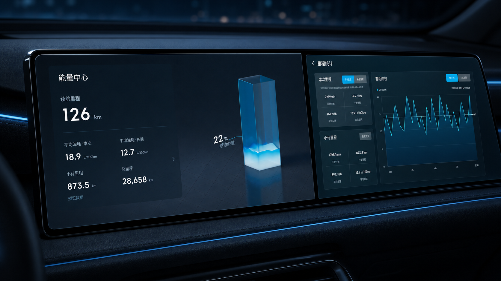
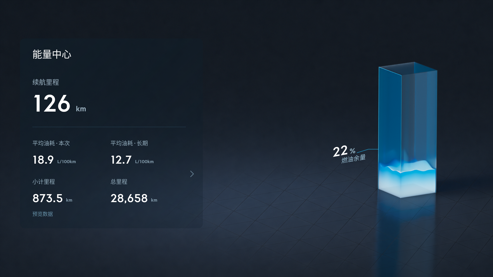
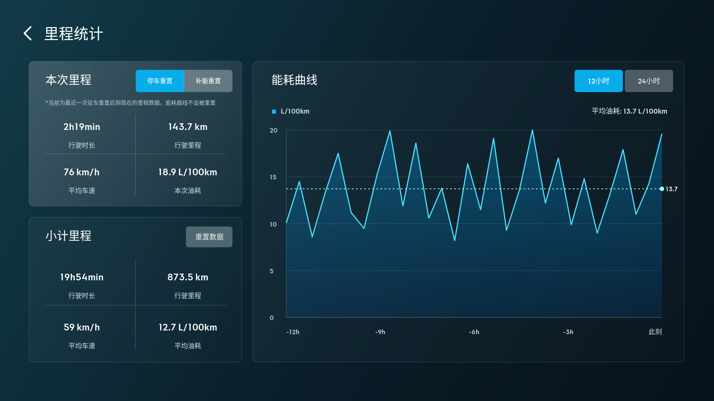
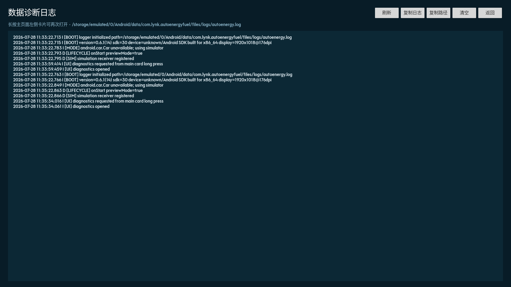

<p align="center">
  
</p>

<h1 align="center">AutoEnergy Fuel UI</h1>

<p align="center">
  面向领克 / Flyme Auto 纯燃油车型的第三方能量中心与里程统计界面
</p>

<p align="center">
  
  
  
  <a href="https://github.com/SakiTomato822/autoenergy-fuel-mod/actions/workflows/build-debug-apk.yml">
    
  </a>
</p>

> [!IMPORTANT]
> 这是一个非官方实验项目，目前只针对特定领克 / Flyme Auto 车机环境开发。模拟器通过不代表车辆一定授予 CarProperty 读取或写入权限，请先阅读[兼容性与风险](#兼容性与风险)。

## 项目简介

AutoEnergy Fuel UI 将原车能量中心改造成更适合纯燃油车型的横屏界面，重点展示续航、燃油余量、平均油耗、里程和行驶统计，同时保留真实车辆属性读取与原车重置逻辑。

应用使用独立包名 `com.lynk.autoenergyfuel`，不会覆盖原厂能量中心。普通 Android 模拟器没有 `android.car.Car` 时，会自动切换到内置车辆数据模拟器，便于在电脑上检查界面和交互。

## 主要功能

- 续航里程、燃油余量与动态液柱展示
- 本次 / 长期平均油耗、小计里程与总里程
- 上下叠加的里程统计页面，无底部双选项卡
- 本次里程与小计里程的时长、距离、平均车速和平均油耗
- 独立的 12 小时 / 24 小时油耗曲线
- 原车停车重置、补能重置和小计里程重置属性写入
- API 30、16:9 横屏车机布局
- 内置 CarProperty 模拟器与多种驾驶场景
- 持久化滚动诊断日志和应用内日志查看器
- 领克车机字体适配

## 实际界面

宣传图用于展示整体氛围，下面是 API 30、1920×1080 模拟器中的真实截图。

<table>
  <tr>
    <td width="50%"></td>
    <td width="50%"></td>
  </tr>
  <tr>
    <td align="center">能量中心</td>
    <td align="center">里程统计</td>
  </tr>
</table>

<details>
  <summary>查看应用内诊断日志页面</summary>
  <br>
  
</details>

## 兼容性与风险

| 项目 | 当前状态 |
| --- | --- |
| 最低系统 | Android 11 / API 30 |
| 目标画布 | 16:9 横屏，主要按 1920×1080 调试 |
| 车辆环境 | 领克 / Flyme Auto，依赖厂商 CarProperty 与 AdapterAPI |
| 模拟器 | 无 `android.car.Car` 时自动启用内置模拟数据 |
| 原厂应用 | 使用独立包名，不覆盖原厂包 |
| 数据读取 | 取决于车机系统签名权限、属性映射和车型支持 |
| 数据写入 | 重置操作会调用车辆属性，务必先在安全环境验证 |

不同车型、系统版本和权限策略可能返回空值、异常值或拒绝访问。首次装车建议先只观察数据读取情况，并通过诊断日志确认属性映射，再尝试重置操作。不要在驾驶过程中调试、操作 ADB 或查看日志。

## 构建

需要 JDK 17、Android SDK 34 和 Gradle 8.7。

```powershell
gradle.bat :app:assembleDebug
```

生成的 APK 位于：

```text
app/build/outputs/apk/debug/app-debug.apk
```

仓库中的 GitHub Actions 工作流也会执行 Debug APK 构建。

## 安装

```powershell
adb install -r app/build/outputs/apk/debug/app-debug.apk
```

应用包名：

```text
com.lynk.autoenergyfuel
```

## 车辆属性映射

| 数据 | API / Property ID | Area ID |
| --- | ---: | ---: |
| 燃油百分比 | `4211968` | `0` |
| 燃油续航 | `1054720` | `0` |
| 总续航 | `291504904` | `0` |
| 总里程 | `291504644` | `0` |
| 平均油耗 | `4194560` | `1` / `2` |
| 行驶距离 | `612373760` | `1` / `2` |
| 平均车速 | `612372992` | `1` / `2` |
| 行驶时长 | `612374016` | `1` / `2` |
| 本次里程重置方式 | `612369152` | `0` |
| 小计里程重置 | `612368896` | `0` |

当前沿用的区域约定：

- Area `2`：本次里程
- Area `1`：小计里程
- 停车重置值：`612369156`
- 补能重置值：`612369154`

## 模拟车辆数据

切换预设场景：

```powershell
adb shell am broadcast `
  -a com.lynk.autoenergyfuel.SIMULATE_CAR_PROPERTY `
  -p com.lynk.autoenergyfuel `
  --es scenario aggressive
```

可用场景：

- `normal`
- `aggressive`
- `low_fuel`
- `full`
- `sensor_fault`

注入单个属性：

```powershell
adb shell am broadcast `
  -a com.lynk.autoenergyfuel.SIMULATE_CAR_PROPERTY `
  -p com.lynk.autoenergyfuel `
  --ei propertyId 4211968 `
  --ei areaId 0 `
  --es value 45
```

使用 `--es value null` 可以模拟属性不可用。

## 诊断日志

在主页面长按左侧大卡片约 1.2 秒，可以打开应用内日志查看器。日志会记录：

- App、设备、系统和显示参数
- 实车 / 模拟器模式
- CarProperty 权限、映射和字段可用性
- 每分钟一次的数据快照
- 重置属性写入结果
- 新出现的异常与堆栈

日志文件：

```text
/sdcard/Android/data/com.lynk.autoenergyfuel/files/logs/autoenergy.log
```

每个日志文件最大 768 KiB，并保留两份滚动备份。可通过 ADB 导出：

```powershell
adb pull /sdcard/Android/data/com.lynk.autoenergyfuel/files/logs/autoenergy.log
```

## 仓库结构

```text
app/
  src/main/java/       车辆属性、模拟器、日志与自绘界面
  src/main/res/        字体、背景和 Android 资源
docs/images/           README 宣传图与真实截图
.github/workflows/     Debug APK 自动构建
tools/                 辅助验证脚本
```

## 版本

- `v0.5.0`：模拟器与燃油主界面基线
- `v0.6.0`：里程统计页面与纯油车布局
- `v0.6.1`：诊断日志、12h / 24h 曲线修复与 API 30 验证

## 声明

本项目与领克、Flyme Auto、亿咖通及其关联公司无官方关系。车型名称、字体、车机视觉素材和相关商标权利归各自权利人所有。

本仓库当前未附带开源许可证；公开源代码不等于授予复制、再分发或商业使用许可。车辆属性写入具有车型和系统差异，使用者需自行承担测试与安装风险。
